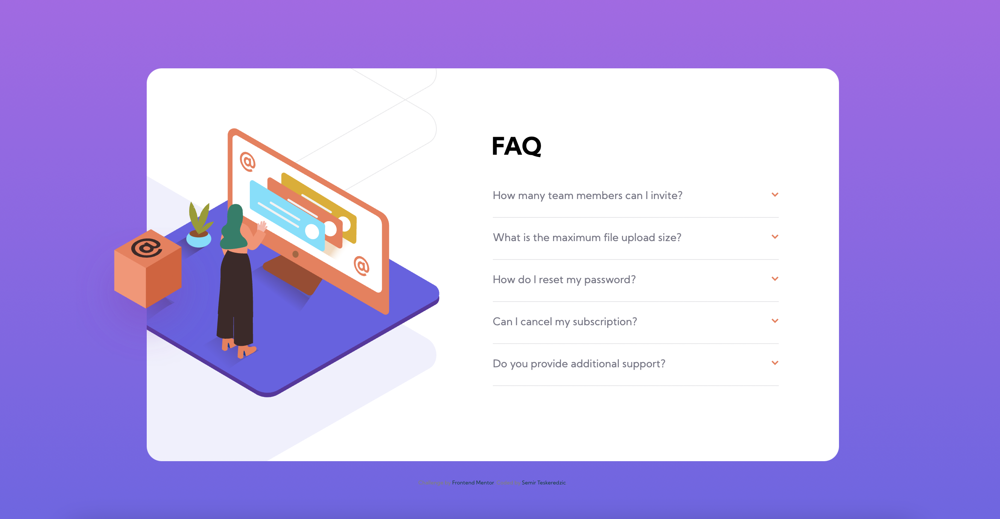
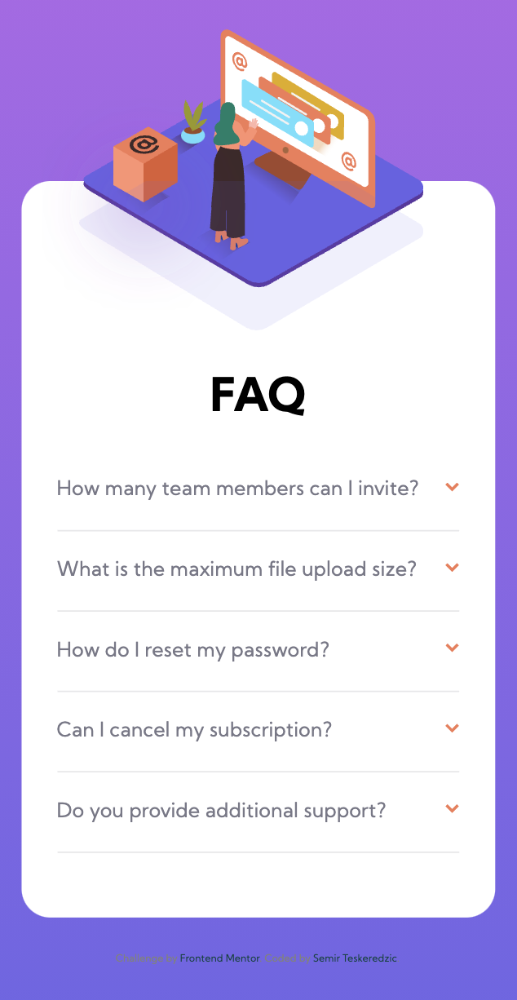

# Frontend Mentor - FAQ accordion card solution

This is a solution to the [FAQ accordion card challenge on Frontend Mentor](https://www.frontendmentor.io/challenges/faq-accordion-card-XlyjD0Oam). Frontend Mentor challenges help you improve your coding skills by building realistic projects. 

## Table of contents

- [Overview](#overview)
  - [The challenge](#the-challenge)
  - [Screenshot](#screenshot)
  - [Links](#links)
- [My process](#my-process)
  - [Built with](#built-with)
- [Author](#author)

## Overview

### The challenge

Users should be able to:

- View the optimal layout for the component depending on their device's screen size
- See hover states for all interactive elements on the page
- Hide/Show the answer to a question when the question is clicked

### Screenshot

### Links

- Solution URL: [Solution URL](https://www.frontendmentor.io/challenges/faq-accordion-card-XlyjD0Oam/hub/faq-accordion-with-html-css-and-a-bit-of-js-DXZTmhEM2)
- Live Site URL: [Live Site URL](https://semirteskeredzic.github.io/faq-accordion/)

## My process

Before starting to code I've created an empty git repository and initialized a git repository inside my project folder, then I set the git remote to the newly created repository.
After that I reviewed design and wrote down HTML structure of elements along with the class names using double and single dash notation. I've created a new preparation branch and went on implementing HTML structure along with global imports of fonts and stylesheets. I've pushed the code and merged it to main branch. I went from mobile view and populated all HTML elements and added icon elements. Then I styled mobile view and inserted JavaScript in script tag. Inside of it, the function hid the answers but used on click listener to open a clicked sibling. In there I've also applied custom styling when opened along with rotating arrow 180deg.
Next up was setting up icons which are absolute and placed above the main container. 
Adaptation for desktop went from 1440px, There I had to display another icons as well as to contain svg background to the container. The content was pushed right and set to 50% of width.

### Built with

- Semantic HTML5 markup
- CSS custom properties
- Flexbox
- JavaScript
- Mobile-first workflow

## Author

- Github - [Semir Teskeredzic](https://github.com/semirteskeredzic)
- Frontend Mentor - [@semirteskeredzic](https://www.frontendmentor.io/profile/semirteskeredzic)
- Twitter - [@dofedome](https://www.twitter.com/dofedome)
